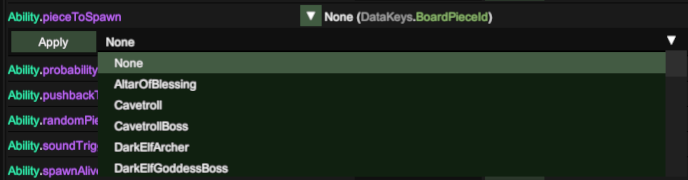

# UnityExplorer Guide for tweaking your own adventures

[UnityExplorer](https://github.com/sinai-dev/UnityExplorer) is a plugin that can be installed onto any Unity based game and allows you to modify many of the game objects in-memory whilst the game is running. This tool can be used to 'tweak' a lot of settings within Demeo allowing you to customise your sessions in the game to your taste.

This guide gives a few examples of how to customise the different character traits within Demeo (e.g. strength, Hit Points, Action Points) and their abilities (e.g. Zap, PoisonArrow, Pierecing spear)

In order to use any of these 'tweaks' in a multiplayer game, the game must be hosted on the same computer where the tweaks were appied.

## Pre-Requisites

Before you can make any tweaks you need to get [UnityExplorer](https://github.com/sinai-dev/UnityExplorer) up and running.

You will need a plugin manager such as [BepInEx](https://github.com/BepInEx/BepInEx/releases) or [MelonLoader](https://melonwiki.xyz/#/) in order to use UnityExplorer.

- The details of how to install BepInEx or MelonLoader are covered on each of the respective sites, but broadly speaking just involve copying a .DLL file into the root of the Demeo game directory.

- Once you have installed the plugin manager, start the game once to create the 'plugins' directory (or 'BepInEx' directory) and then quit.

- Copy the UnityExplorer DLL into the plugins (or BepInEx) folder and start the game.

*N.B.* We’re messing with the game in-memory here, so what the game is doing is important. You need to skip the tutorial part of the game when it start up before you search/change any values or you’ll just be editing the tutorial.

Here’s how things look on the PC with UnityExplorer installed.

## The Easy Stuff – PieceConfig

The easiest and most rewarding bits to change can be found by typing `piececonfig` in the search box and clicking ‘search’ (pressing Enter does nothing).

You will now have listed all of the different pieces that move around the board… Baddies and Goodies. The player pieces all have names starting with `PieceConfig_Hero*`, but your allies include:

- PieceConfig_AltarOfBlessing
- PieceConfig_BeaconOfHealing(healingward)
- PieceConfig_BeaconOfSmite(Behemoth)
- PieceConfig_Seeker(detectenemies)
- PieceConfigSwordOfAvalon(Ballista)
- PieceConfig_WolfCompanion(Hunter’s dog companion)
- PieceConfig_Torch

When you click on a thing, you get all of the information loaded in another window. Within that window you can tweak settings for Hit Points, Melee attack damange, Starting Health (HP), Armor, MovementRange, VisionRange. Each time you change a setting you need to click on ‘apply’ and the settings only apply to pieces which are not already present on the board. (e.g. mod your heros before you start a game because you can't do it after). It is possible to do things such as increasing hit points on the Hunter’s Companion immediately before the card is played to give the dog extra HP or stronger attack etc.
Attempting to change immunity to status effects, behaviours and the other settings with ‘Inspect’ buttons next to them appears to have no effect.

Some tweaks work multiplayer (the ones described above), and others only work on your PC. For example, changing the FogOfWar settings for a piece only works on the local PC.. all remote players will have the default setting. Demeo uses whichever player hosted the game to do all of the maths about attacks, damage, movement etc, but the remote players all update their own boards based on local code. e.g. some things work, others do not.

## Abilities

Start typing `ability` into the `Class Filter` box and choose `Boardgame.BoardEntities.Abilties.Ability` from the list, leave the search box empty and then click on ‘Search’ to get the list of all of the abilities in the game.
There is so much fun to be had in here.

Let’s tweak the Sorcer’s ‘Zap’ spell as an example. Search for Name Contains ‘zap’ and you’ll get two of them listed. The only ones you need to tweak are the ones marked (Clone) – These are created as in-memory copies of the game’s base object when it starts up and are used for the play sessions.

Click on ‘Zap(Clone)’ to get all of the details up.

### Fun things to change

1.) Damage done by the spell

2.) Zero AP for whatever you like

3.) Add poison gas to whatever tile the zap hits..

4.) Knockback (only seems to work with 0,1 or 2 for values)

5.) Spawn a thing where your zap hits (two settings to change)

and..

6.) Area of effect
Click on the ‘Inspect’ button next to Area of Effect

Tweak the settings in the window that pops up

Other abilities
It’s not just your abilities that are listed here. Every ability in the game including things everything that spawns a thing…

You can change anything that spawns a thing to spawn a different thing instead. For example, change ‘SpawnRat(Clone)’ to make rats nests produce GoldPiles instead of rats.

## Statmodifiers

Strength, Speed, Weakness etc can be tweaked in here.

Make your strength/speed potions add +3 instead of +1

## Tweaking for optimal gameplay

It’s very easy to make the game so easy that it’s pointless.
Here’s some of the mods that my friends and I like to use which are fun but not too overboard.

1. Add AOE on the abilities for strength/speed potions so that everyone gets to benefit.. Make for a nice regrouping gameplay dynamic and means your allies can also get a boost.
1. 0AP zap for the Sorcerer (makes the character much better to play).
1. Super-Verrochka (Hunters Dog). More HP and stronger attack… Doesn’t unbalance things too much.
1. Extra AP and/or stronger attack for Behemoth (Beacon_of_smite) and Ballista
1. Set the vision range for the torch to 40, and place on the ground. Even when the 9-turn countdown expires it still lights everything up (torch still dies if you’re wearing it though because it’s no a ‘piece’ anymore.. it’s a StatusEffect instead).

## WHEN SHTF in your game

When your party is getting slaughtered and the it's clear you're all going to die, set the ‘PlayerMelee(Clone)’ action to have 0AP cost. Now you can hack at the enemies face-to-face for as long as you like – This is Incredibly cheaty, but sometimes you just have to see things through to the finish.

## My Favourite tweak

Having HuntersArrow set a tile status effect of ‘Gas’ and also with ‘CanExplodeGas’ set to true. Exploding arrows every time with around double-damage. Sadly the animation for this only works locally, but it looks great.

Enjoy - (Fecn) 🙂
